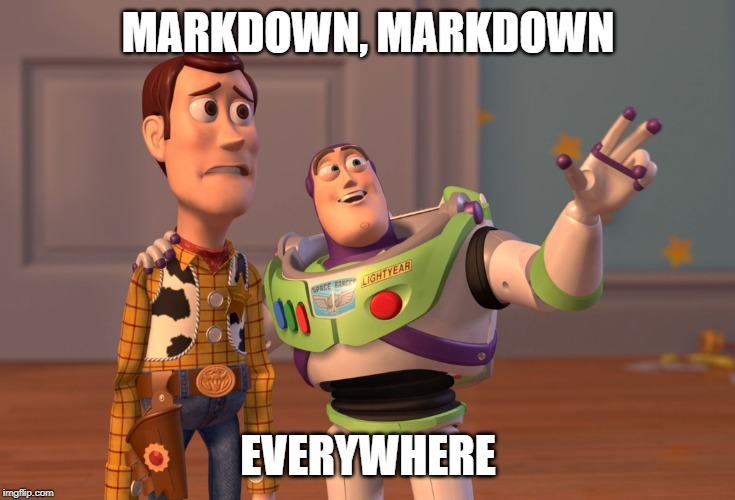

```{r setup, include=FALSE}
knitr::opts_chunk$set(echo = FALSE)
library(here)
library(knitr)
library(kableExtra)
library(flextable)
library(tidyverse)
library(xaringanthemer)
library(shiny)
library(countdown)
solarized_dark()
```

## Purpose

1. Introduce Markdown as a bare bones text-only format that allows to format text,
   insert links, insert images.
2. Introduce RMarkdown as a tool to weave together text and analysis (tables, figures,
   plots, individual numbers).
3. Demonstrate other uses of Markdown (Stata, Python notebooks, diagrams)
4. Demonstrate flexible / reproducible report generation with Markdown templates
   and input parameters.

Helpful upfront knowledge: some R; some HTML

---

## Why I am here

1996: learned LaTeX by forcing myself to do Econ homeworks

2007-ish: wrote a long simulation paper on empirical likelihood 
by summarizing results in Stata with the likes of

```
for j=1/5 {
  sum beta`k'
  file write " & " (r(mean)) " & " (r(sd) )
  count if abs( (beta`k' - true_beta`k')/se_beta`k' ) < invnorm(0.975)
  file write " & " (r(N)/_N*100) "\% \\" _n
}
```

2015-ish: was preparing for a course on webscraping in R, brushed up R skills,
stumbled upon [R4DS](https://r4ds.had.co.nz/). Wrote my next weighting report in
Markdown, and now do 98% of my R coding work in markdown.

---

## My take on software

- One rectangular data set, analysis leading up to a handful of regresion tables: Stata
- Develop and deploy algorithms on web: Python, Java
- Produce reports: R

---

## Birds do it, bees do it

Do I need to say anything about the educated fleas??

https://medium.com/@urban_institute/r-is-the-best-programming-language-for-innovation-at-urban-155e2ebf5c74

https://medium.com/@urban_institute/iterated-fact-sheets-with-r-markdown-d685eb4eafce

https://medium.com/pew-research-center-decoded/using-tidyverse-tools-with-pew-research-center-survey-data-in-r-bdfe61de0909

https://learn.r-journalism.com/en/publishing/

---

## Building blocks of my workflow

- RMarkdown
- R tidyverse (pipes!)
- Version control
- Cheat sheets

Nicely packaged within RStudio

- Google and Twitter

---

## Copy-paste vs. markdown


---

## Markdown



---

## Examples

Books in markdown: http://bookdown.org, https://r4ds.had.co.nz/

Dashboards in R markdown: [CRAN download gauge](https://gallery.shinyapps.io/cran-gauge/)

Diagrams: [Typora diagrams](http://support.typora.io/Draw-Diagrams-With-Markdown/)

Markdowns with several languages: [ICHPS 2020 Complex Surveys](
https://htmlpreview.github.io/?https://github.com/skolenik/ICHPS2020-svy/blob/master/ichps2020-svy.html)

Browser presentations: this webinar (show [the source](markdown-talk-June2020.Rmd)!)

---

## Markdown

When you make your text **bold**, or _italic_, or `paste code snippets`, or create

- items in lists
- and more items

you are _marking_ certain elements of your text to be formated in a special way.
(The heading above is also a marked text.)

Markdown modifies this to a very bare bones, text-only, no-mouse-selection-needed process.
The name is supposed to be a play on "markup" which is a technical term to describe
languages like HTML, XML, or LaTeX.

https://daringfireball.net/projects/markdown/syntax

---

## Markdown elements

```

Pieces of `code`

Text in _italics_

Text in **bold**

### Heading 3

- unnumbered item
    + nested list item

1. numbered item

```

---

## Exercise

1. Go to [SlackEdit](https://stackedit.io/app#) online editor.
2. Open/create a new file (click `r icon('folder', lib='font-awesome')` to open the file menu).
3. Enter the following in the editor with formatting, watch the rendered version in the right pane:

# Header 1: This is my first markdown file.

Hi, I am **Stas** _Kolenikov_. I use Markdown to:

- create simple documents
    + take notes
    + make to-do lists

```{r exercise1_timer}
countdown(minutes=5)
```

---

## Solution

```
# This is my first markdown file.

Hi, I am **FirstName** _LastName_. I am using Markdown to:

- create simple documents
    + take notes
    + make to-do lists
```

---

## R Markdown

Additionally, R and some other languages can 

- incorporate source code 
- incorporate the output, such as numbers, tables, and plots

... into Markdown documents

```` 
```{r} 

# some code here

``` 
````

---

## Tidy pipes 


R `library(magritr)` introduced a pipe operator `%>%` that allows stringing 
of manipulations / adjustment of formatting options. It helps isolating steps
in data prep, analysis, and creation of graphs (`library(ggplot2)` although it uses
`+` for piping) and tables.

[Treachery of Images](https://en.wikipedia.org/wiki/The_Treachery_of_Images)

---

## KFF tracking poll

[Simplified KFF report: source](KFF-report.Rmd)

[Simplified KFF report: rendered](KFF-report.html)

---

## To learn more: cheatsheets

https://www.rstudio.com/resources/cheatsheets/

---

## Graphics

```{r, echo=FALSE, fig.width=6.5, fig.height=3.5, warning=FALSE}
readRDS(here('q1plot.Rds'))
```

```
library(ggplot2)
```

and a myriad of extentions to it.

---

## Tables

```{r}
readRDS(here('KFF_MOE.Rds')) %>% 
  select(Group, `N (unweighted)`,MOE) %>%  
  kable() %>% kable_styling(bootstrap_options = c("striped", "hover", "condensed"))
```

A lot of output looks like a table already: regression results, cross-tabs

```
# aimed at HTML
library(kableExtra)
# aimed more at MS products
library(flextable)
```

---

## library(kableExtra)

Compared to others, produces much nicer tables in HTML, but MS Word breaks down.

```{r MOE_kableExtra}
readRDS(here('KFF_MOE.Rds')) %>% 
  mutate(`N (unweighted)` = cell_spec(`N (unweighted)`, "html", 
                            font_size = spec_font_size(neff) ) ) %>% # fancy sample size
  select(Group, `N (unweighted)`,MOE) %>%  
  kable(escape=FALSE) %>% 
  row_spec(0,color='white',background="#48A9C5") %>%  # header colors
  row_spec(2,align="center") %>%                      # put "Party ID" in the center
  kable_styling(bootstrap_options = c("striped", "hover", "condensed"))
```

[Documentation vignette: ]
(https://cran.r-project.org/web/packages/kableExtra/vignettes/awesome_table_in_html.html)

---

## library(flextable)

Compared to others, produces reasonably nice table in both HTML and MS Word.

```{r MOE_flextable}
readRDS(here('KFF_MOE.Rds')) %>% 
  select(Group, `N (unweighted)`,MOE) %>%  
  flextable() %>%             # convert to flextable
  align(j=1,align="left") %>%         # change alignment
  align(i=2,j=1,align="center") %>%   # put "Party ID" in the center
  bg(bg="#48A9C5", part="header") %>% # header colors
  color(color="white", part="header") %>%
  bg(bg="white", part="body") %>%
  autofit()                           # some magic in column widths
```

---

## R chunk options

```` 
```{r ChunkName, echo=FALSE} 

# some code here that I don't want to see in the final output

``` 
````

Review the chunk options in [RStudio cheatsheet]
(https://github.com/rstudio/cheatsheets/raw/master/rmarkdown-2.0.pdf)

---

## Parametric markdown documents

The more advanced forms of markdown documents use inputs/parameters.

- Output format: HTML (the most flexible, and the only interactive), Word, PDF (requires LaTeX)
- Task to perform: analysis vs. reporting the results
- Input data files
- Formatting specifications (e.g. digits to report)

Parametric markdowns are to be used from command line / R scripts:

```
rmarkdown::render( ..., params=list(todo='analysis',
    input_data='KFF-April2019.sav'))
```

---

## Parametric markdown: output

```
filename_stub <- 'MyReport'
rmarkdown::render(input=paste0(filename_stub,.'Rmd'),   # input file
  output_file=I(paste0(filename_stub,'-',Sys.Date())),  
         # output file with date embedded, no extension
  output_format='docx_document')                        
         # output format and extension
  # output_format='html_document')                      
         # alternative output format
)  
```

---

## Parametric markdown: YAML header

```
title: "Reproducible report generation using Markdown"
author: "Stas Kolenikov"
date: Sys.Date()
output:
  html_output:
    code_folding: hide
    toc: TRUE
  word_document:
    reference_docx: Abt_2018_Report_Template.docx
```

---

## Parametric markdown: YAML header

```
title: "Reproducible report generation using Markdown"
author: "Stas Kolenikov"
date: Sys.Date()
params:
  todo: analysis
  # todo: reporting
  data_source: April2019.dta
  # data_source: Mar2019.dta
  digits: 4
```

---

## Parametric markdown: tasks to do

````
```r long_analysis
if (params$todo=="analysis") {
  # mixed modeling code that takes hours to execute
  model1 <- ...
  saveRDS(model1, file='model1.Rds')
} else if (params$todo=="reporting") {
  model1 <- readRDS(file='model1.Rds')
}
```
````

---

## Parametric markdown: varying data sources

Explicit naming:

````

---
params:
  data_source: KFF-April2019.sav
---
```r read_data
main_data <- read.sav( params$data_source )
```

````

---

## Parametric markdown: varying data sources

Combining parts:

````

---
params:
  month: April
---

```r read_data_by_month
main_data <- read.sav( paste0( 'KFF-',params$month, '2019.sav' ) )
```

````

Which can be rendered with

```
filename_stub <- 'MyReport'
month         <- 'April'
rmarkdown::render(input=paste0(filename_stub,.'Rmd'),   # input file
  output_file=I(paste0(filename_stub,'-',month,'-',Sys.Date())),  
  output_format='docx_document'),                       # output format
  params=list(month=month)                              # pass parameters
)
```

---

## Reasons for markdown

1. Combine narrative and data analysis
2. Reproduce your work (reports, revisions)
3. Reuse the code with different options, sources, formatting, ...
4. Version control over the plain text

---

## Reasons for markdown: version control


---

## Version control

This talk:

- https://github.com/skolenik/markdown2020

VCS training, of sorts (~1.5 hrs)

- https://github.com/skolenik/shower-vcs

A complete introduction to using Git with RStudio

- https://happygitwithr.com/ by @JennyBryan

---

## One foot in front of the other

Gradual, incremental changes

- convert a section / 3-5 tables/plots to R per monthly report
    * ask "how do I" questions on Twitter, and/or
    * ask "how do I" questions on RStudio community

---

## Pain points

Early on:
- Interface
- Command line and scripts
- Obscure error messages
- Multiple R syntaxes (base R, formulas, tidyverse)
- Too many resources

Intermediate to advanced:
- Labeled integers vs. strings vs. factor variables
- Package versioning and management

---

## Markdown in other languages

Stata: markstat

---

## Markdown in other languages

Python: markdown cells in notebooks

---

## Markdown in other languages

Diagrams: `mermaid` in Typora

---

## Thanks

Stas Kolenikov

Twitter [@StatStas](http://twitter.com/StatStas)
