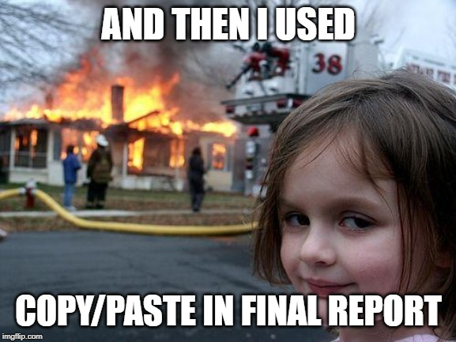

```{r setup, include=FALSE}
knitr::opts_chunk$set(echo = FALSE)
library(here)
library(kableExtra)
library(tidyverse)
library(xaringanthemer)
library(shiny)
solarized_dark()
```

## Why I am here

1996: learned LaTeX by forcing myself to do Econ homeworks

2007-ish: wrote a long simulation paper on empirical likelihood 
by summarizing results in Stata with the likes of

```
for j=1/5 {
  sum beta`k'
  file write " & " (r(mean)) " & " (r(se) )
  count if abs( (beta`k' - true_beta`k')/se_beta`k' ) < invnorm(0.975)
  file write " & " (r(N)/_N*100) "\% \\" _n
}
```

2015-ish: was preparing for a course on webscraping in R, brushed up R skills,
stumbled upon [R4DS](https://r4ds.had.co.nz/). Wrote my next weighting report in
Markdown, and now do 98% of my R coding work in markdown.

---

## My take on software

- One rectangular data set, analysis leading up to a handful of regresion tables: Stata
- Develop and deploy algorithms on web: Python, Java
- Produce reports: R

---

## Birds do it, bees do it

Do I need to say anything about the educated fleas??

https://medium.com/@urban_institute/r-is-the-best-programming-language-for-innovation-at-urban-155e2ebf5c74

https://medium.com/@urban_institute/iterated-fact-sheets-with-r-markdown-d685eb4eafce

https://medium.com/pew-research-center-decoded/using-tidyverse-tools-with-pew-research-center-survey-data-in-r-bdfe61de0909

https://learn.r-journalism.com/en/publishing/

---

## Building blocks of my workflow

- RMarkdown
- R tidyverse
- Version control
- Cheat sheets

Nicely packaged within RStudio

- Google and Twitter

---

## Markdown


---

## Markdown

When you make your text **bold**, or _italic_, or `paste code snippets`, or create

- items in lists
- and more items

you are _marking_ certain elements of your text to be formated in a special way.
(The heading above is also a marked text.)

Markdown modifies this to a very bare bones, text-only, no-mouse-selection-needed process.
The name is supposed to be a play on "markup" which is a technical term to describe
languages like HTML, XML, or LaTeX.

https://daringfireball.net/projects/markdown/syntax

---

## Markdown elements

```

Pieces of `code`

Text in _italics_

Text in **bold**

### Heading 3

- unnumbered item
    + nested list item

1. numbered item

```

---

## Exercise

1. Go to [SlackEdit](https://stackedit.io/app#) online editor.
2. Open/create a new file (click `r icon('folder', lib='font-awesome')` to open the file menu).
3. Enter the following with formatting:

# This is my first markdown file.

Hi, I am **Stas** _Kolenikov_. I use Markdown to:

- create simple documents
    + take notes
    + make to-do lists

---

## Solution

```
# This is my first markdown file.

Hi, I am **FirstName** _LastName_. I am using Markdown to:

- create simple documents
    + take notes
    + make to-do lists
```

---

## R Markdown

Additionally, R and some other languages can 

- incorporate source code 
- incorporate theoutput, such as numbers, tables, and plots

... into Markdown documents

[Simplified KFF report](KFF-report.html)


---

## Parametric markdown documents

The most advanced forms of markdown documents use inputs/parameters.

- Output format: HTML (the most flexible, and the only interactive), Word, PDF (requires LaTeX)
- Task to perform: analysis vs. reporting the results
- Input data files

---

## Copy-paste vs. markdown



---

## Version control


---

## Version control

This talk:

https://github.com/skolenik/markdown2020

VCS training, of sorts (~1.5 hrs)

https://github.com/skolenik/shower-vcs


## Cheatsheets

https://www.rstudio.com/resources/cheatsheets/

---

## Graphics

```{r, echo=FALSE, fig.width=6.5, fig.height=3.5, warning=FALSE}
readRDS(here('q1plot.Rds'))
```

```
library(ggplot2)
```

and a myriad of extentions to it.


---

## Tables

```{r}
readRDS(here('KFF_MOE.Rds')) %>% 
  select(Group, `N (unweighted)`,MOE) %>%  
  kable() %>% kable_styling(bootstrap_options = c("striped", "hover", "condensed"))
```

A lot of output looks like a table already: regression results, cross-tabs

```
# aimed at HTML
library(kableExtra)
# aimed specifically at MS products
library(flextable)
```

---

## Resources on R

- RStudio
- R4DS
- Twitter `#rstats`
- Online forums

---

## RStudio

https://resources.rstudio.com/webinars

I recommend:
- RStudio IDE (3 webinars)
- Getting data into R
- Writing code (Programming Part 1)
- Data wrangling
- Interactive reporting
- Managing (3 webinars)

That's ~10 hours of pure learning

[RStudio 2020 Conference](http://www.rstd.io/conf): San Francisco, January 27-30.

---

## R4DS


- Published book
- Online book: https://r4ds.had.co.nz/
- Markdown source: https://github.com/hadley/r4ds

- Online community: https://www.rfordatasci.com/ (@r4dscommunity)

Try going 1 chapter/week

---

## Stackoverflow

https://stackoverflow.com/questions/tagged/r

---

## Twitter

This is where I learned the most: follow `#rstats` tag (or @rstatstweet that RTs stuff)

https://twitter.com/hashtag/rstats?f=tweets&vertical=default&src=hash&lang=en


---

## Code version control in R

https://happygitwithr.com/ by @JennyBryan

- a reasonably complete introduction to using Git with RStudio

---

## One foot in front of the other

Gradual, incremental changes

- a chapter of R4DS/week
- convert a section / 3-5 tables/plots to R per monthly report
    * ask "how do I" questions on Twitter, and/or
    * ask "how do I" questions on RStudio community

---

## Pain points

Early on:
- Interface
- Command line and scripts
- Obscure error messages
- Multiple R syntaxes (base R, formulas, tidyverse)
- Too many resources

Intermediate to advanced:
- Labeled integers vs. strings vs. factor variables
- Package versioning and management

---

## Thanks

Stas Kolenikov

Twitter [@StatStas](http://twitter.com/StatStas)
