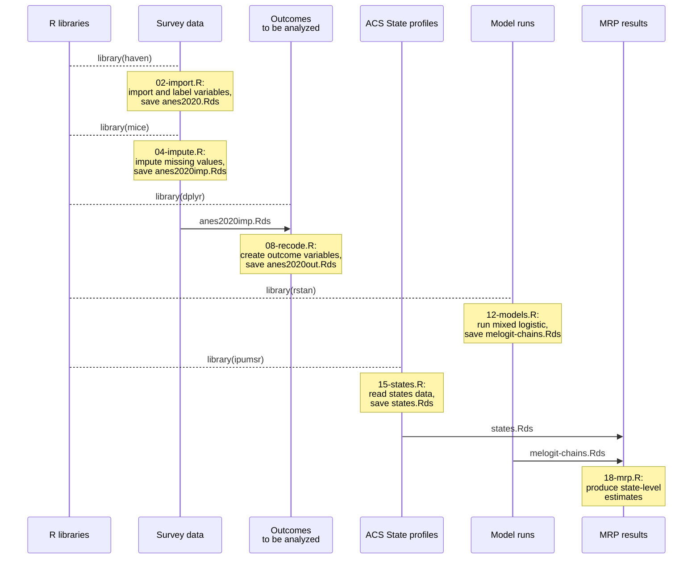

```mermaid
sequenceDiagram
  participant lib as R libraries
  participant svy as Survey data
  participant out as Outcomes <br/> to be analyzed
  participant st as ACS State profiles
  participant pred as Model runs
  participant mrp as MRP results
%% spacer  
  lib --> svy: library(haven)
  Note over svy: 02-import.R: <br/>  import and label variables, <br/> save anes2020.Rds
  
  lib --> svy: library(mice)
  Note over svy: 04-impute.R: <br/>impute missing values, <br/>save anes2020imp.Rds
  
  lib --> out: library(dplyr)
  svy ->> out: anes2020imp.Rds
  Note over out: 08-recode.R: <br/>create outcome variables, <br/>save anes2020out.Rds
  
  lib --> pred: library(rstan)
  Note over pred: 12-models.R: <br/>run mixed logistic, <br/>save melogit-chains.Rds
  
  lib --> st: library(ipumsr)
  Note over st: 15-states.R: <br/>read states data, <br/>save states.Rds
  
  st ->> mrp: states.Rds
  pred ->> mrp: melogit-chains.Rds
  Note over mrp: 18-mrp.R: <br/>produce state-level <br/>estimates
```

